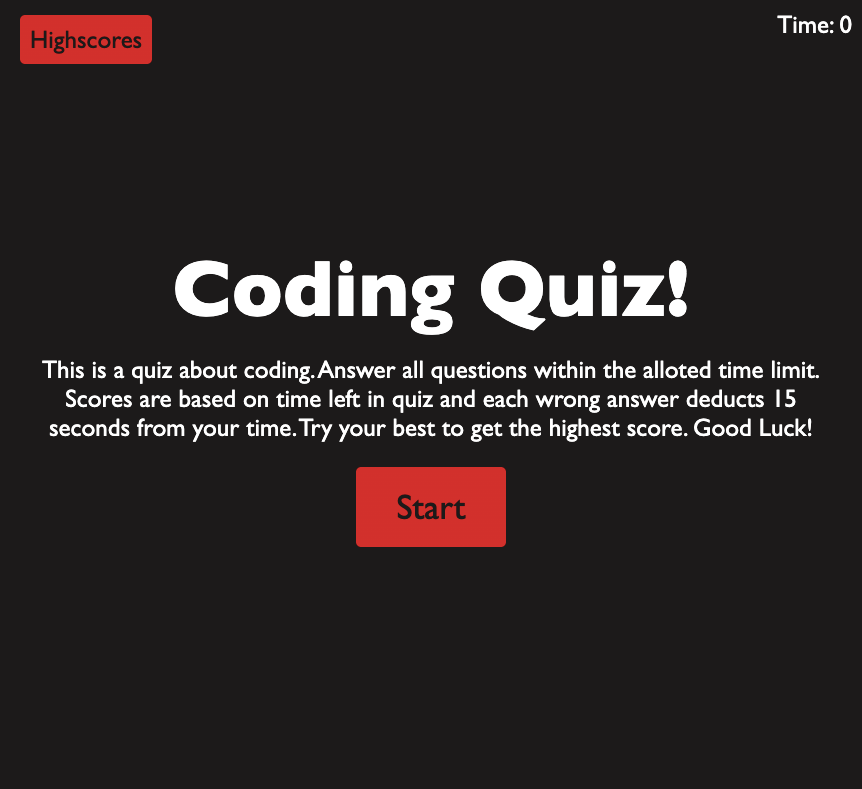
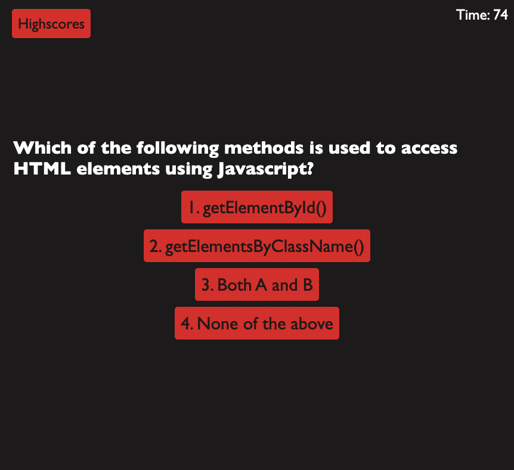
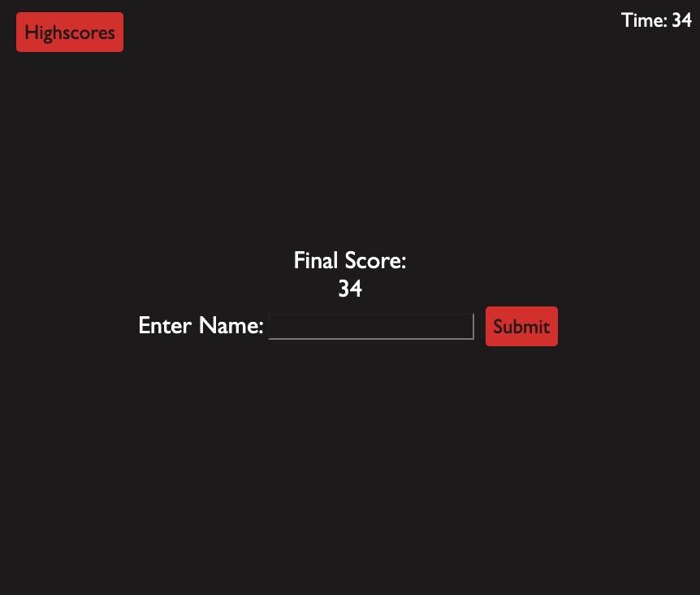
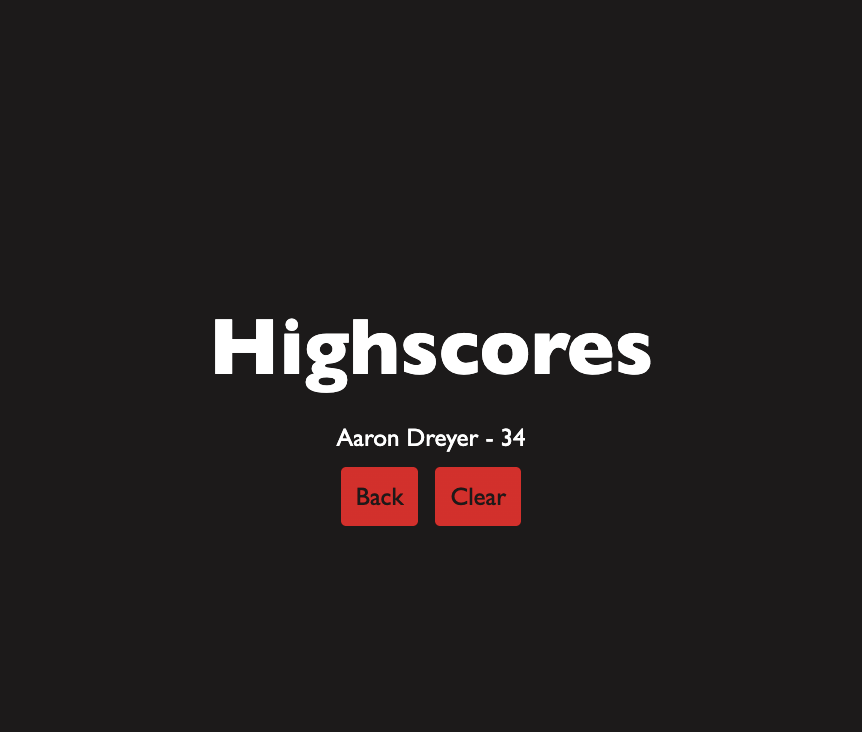

# Coding Quiz: mega-code-quiz

## Description

This is a quiz about coding using html, css, and javascript. The main portion of the javascript is centered around Web APIs and uses the DOM to create a functioning multiple choice quiz with a point system, time limit, and highscore log. The quiz must feature several questions that need to be answered in within a time limit. However any missed question will deduct a certain amount of time. The score in which you get will be the time left in the counter. This score must then be logged to the website and be viewed by the user. 

## Task completed

- Create an html system that features the start page, questions, and highscore log
- Create a javascript file that allows questions to appear, have clickable buttons for the answers, and log the correct or wrong answers
- Add a time limit to the quiz that connects with the questions based on right or wrong answers (deduction)
- Maintain a point system where the user can see how well they have done by the end
- Create a page for the points gathered in the quiz to be published as a score for the user to see
- Style the quiz to have functional buttons for start, answers, and altering through pages
- Make quiz accessible to others

## Link

[Link to deployed website](https://aarondreyer.github.io/mega-code-quiz/)

[Link to Repository](https://github.com/AaronDreyer/mega-code-quiz)

## Installation

Access application through github by deploying index.html, style.css, and README.md

Links above bring user to deployed page and github repository

## Usage

This application demonstrates how to use Web APIs to make a functional website, interactable data selection, and log that data to the website itself. This is a website where you can see the functionality through a quiz, have interactable data through answer selection, and logging of data through highscore recording.

## Credits

Credit for the total completion of assignment include: TAs, instructor, and students of the 2022 Georgia Tech Coding Bootcamp. Their assistance allowed for the assignment to meet all requirements.

Following Websites were used:
- https://youtu.be/f4fB9Xg2JEY
- https://youtu.be/-cX5jnQgqSM
- https://youtu.be/f24W7gzdBec
- https://www.w3schools.com/css/css_rwd_mediaqueries.asp
- https://www.geeksforgeeks.org/css/
- https://github.com/jamierachael/Code-Quiz
- https://www.codehim.com/vanilla-javascript/javascript-multiple-choice-questions-code/
- https://www.interviewbit.com/javascript-mcq/

## License

License provided by Georgia Tech Bootcamp.

External liscense not specified.

